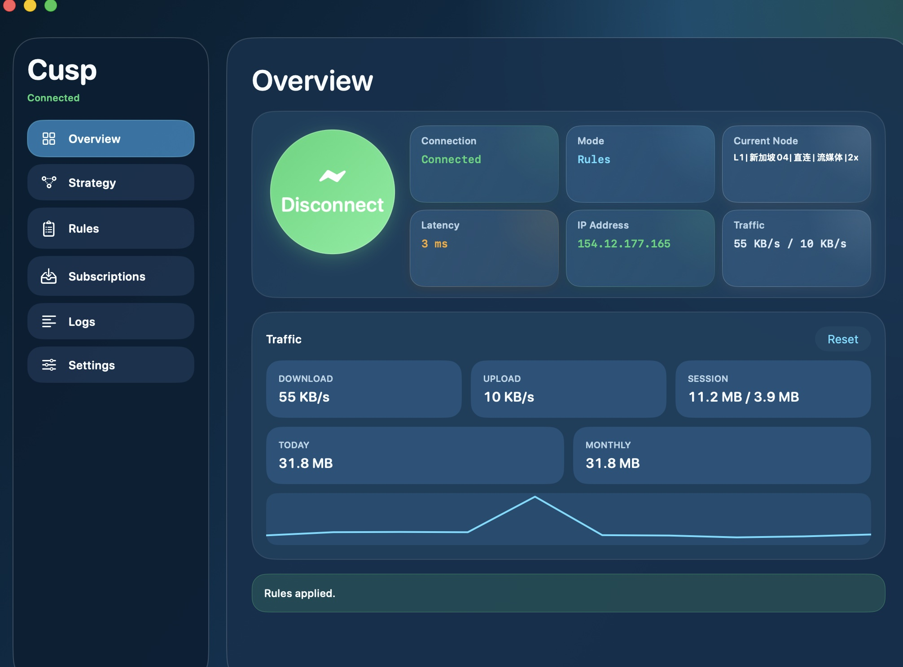
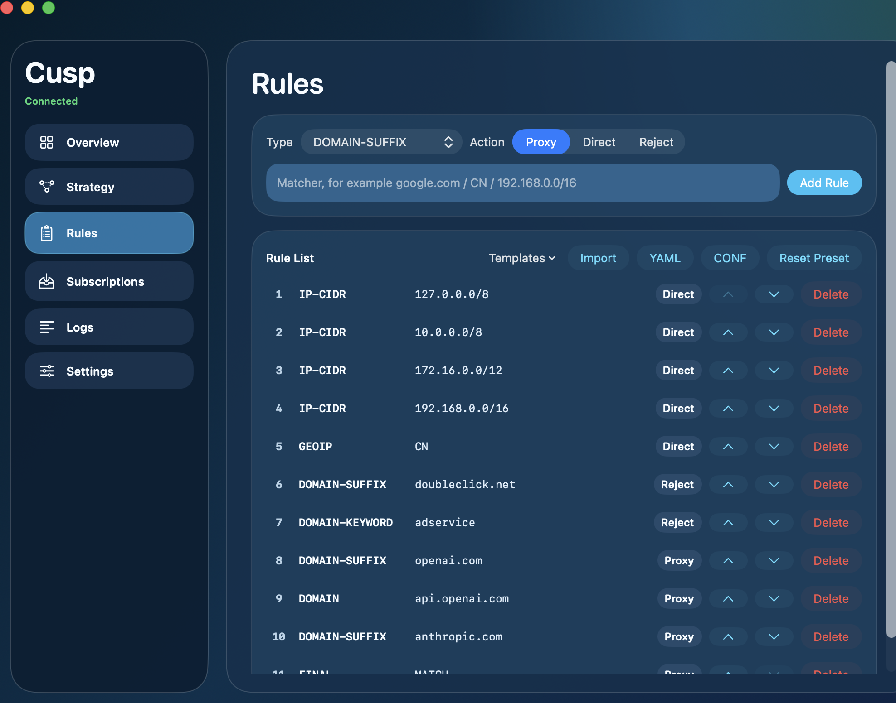
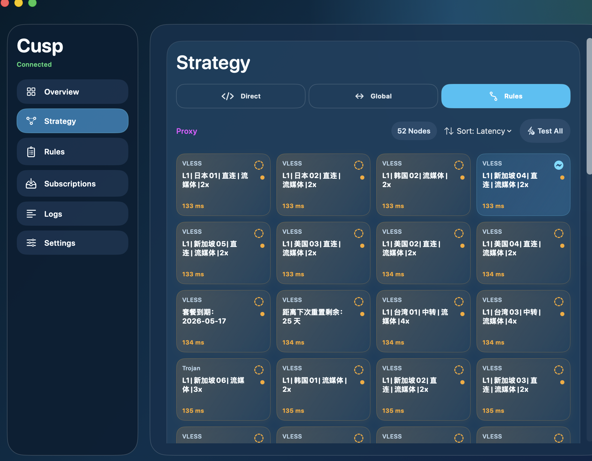

# Cusp

Cusp is a native macOS proxy client focused on clarity, stability, and fast daily operations.

## Highlights

- Native SwiftUI architecture for local proxy orchestration
- Clash/Mihomo subscription parsing (common protocols, including SS/VMess/Trojan/VLESS)
- Real runtime mode switching: `Direct` / `Global` / `Rules`
- Strategy groups with effective selection and runtime application
- Menu bar quick actions for connect, mode switch, node switch, strategy switch
- Built-in latency tests, logs, and subscription diagnostics
- English + Simplified Chinese UI

## Project Structure

```text
CuspApp/                # Main macOS app (UI, state, menu bar)
Sources/CuspShared/     # Shared core logic (parsing, config builder, runtime helpers)
Tests/CuspSharedTests/  # Shared-layer unit tests
Resources/                  # Runtime resources (mihomo binary placeholder, etc.)
Docs/                       # PRD and design/iteration notes
Scripts/                    # Utility scripts (e.g. Xcode project generation)
```

## Architecture Overview

- `CuspApp`: user interactions, view models, menu bar orchestration
- `CuspShared`: subscription parsing, node catalog, rule/model mapping, Mihomo config generation

Data flow:
1. Import subscription(s)
2. Parse and normalize nodes/rules
3. Build Mihomo runtime config
4. Start local runtime process and apply system proxy
5. Apply system proxy and update app/menu state

## Requirements

- macOS 14+
- Xcode 16+ (or toolchain compatible with Swift 6)

## Build & Run

Use the helper script:

```bash
./run.sh
```

Manual build:

```bash
xcodebuild \
  -project Cusp.xcodeproj \
  -scheme Cusp \
  -configuration Debug \
  -derivedDataPath .build/xcode \
  build CODE_SIGNING_ALLOWED=NO
```

## Testing

```bash
swift test
```

## Local Unsigned Packaging

If you do not have an Apple Developer account yet, generate unsigned local release artifacts with:

```bash
./Scripts/release_unsigned_local.sh v0.1.0
```

Pre-release open-source checks:

```bash
./Scripts/open_source_preflight.sh
```

## Runtime Resources

`Resources/mihomo/mihomo` is expected at runtime.  
This repository currently includes a pinned `mihomo` binary for macOS arm64 to simplify first-run setup.
If you need to upgrade or replace it, keep the version and checksum records in `THIRD_PARTY_LICENSES.md` in sync.

## Current Scope

- macOS desktop only
- Local runtime orchestration and UI operation
- Subscription import, rule editing, strategy selection, diagnostics

## Roadmap (Short Term)

- Split oversized view model into domain modules
- Complete secrets hardening and migration checks
- Improve rule hit visibility and troubleshooting experience
- Continue visual and interaction polishing aligned with premium macOS apps

## Security & Open Source Notes

See `/Docs/Open-Source-Risk-Assessment.md` for risk analysis and release checklist.
See `/Docs/Release-Guide.md` for CI release packaging and notarization setup.

## Governance Files

- `LICENSE`
- `SECURITY.md`
- `CONTRIBUTING.md`
- `THIRD_PARTY_LICENSES.md`
- `CODE_OF_CONDUCT.md`
- `CHANGELOG.md`


## xx


